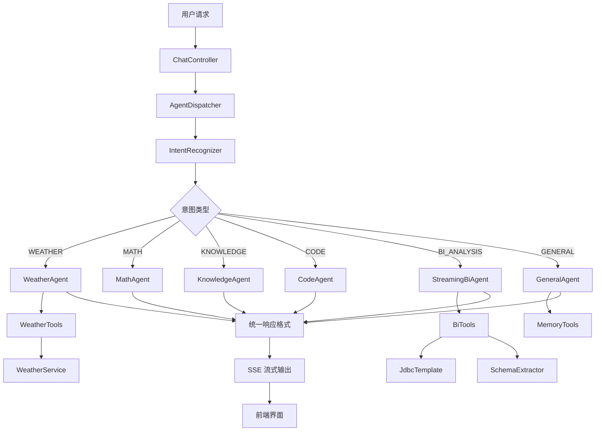
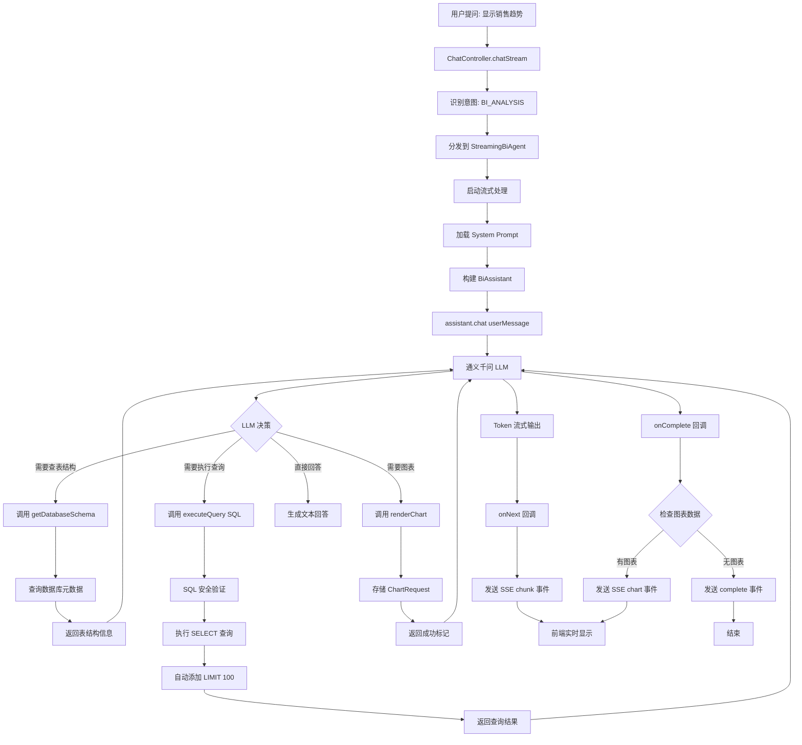
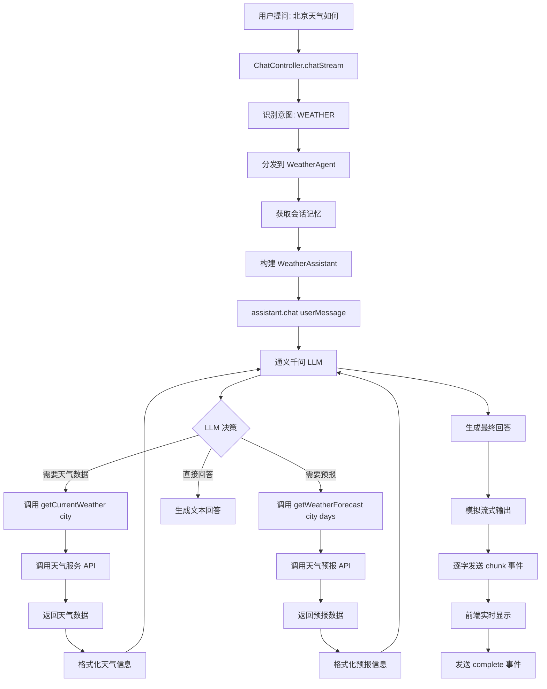
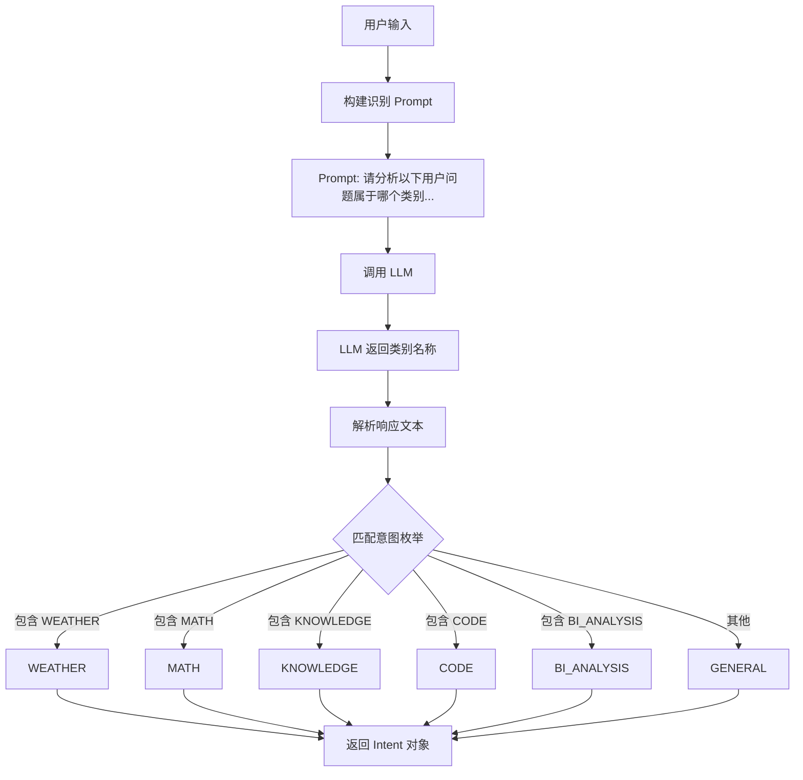

# 多 Agent 智能分发系统 - 技术架构文档

## 📋 目录
- [1. 系统调用链路流程图](#1-系统调用链路流程图)
- [2. System Prompt 定义](#2-system-prompt-定义)
- [3. Function Calling 工具定义](#3-function-calling-工具定义)
- [4. 意图识别机制](#4-意图识别机制)
- [5. SSE 流式输出协议](#5-sse-流式输出协议)

---

## 1. 系统调用链路流程图

### 1.1 整体架构流程



### 1.2 BI Agent 详细调用链路（Function Calling）



### 1.3 普通 Agent 调用链路（以 WeatherAgent 为例）



### 1.4 意图识别流程



---

## 2. System Prompt 定义

### 2.1 BI Agent System Prompt（数据分析助手）

**位置**: `src/main/java/com/example/function_calling/agent/StreamingBiAgent.java`

```java
String systemPrompt = 
    "你是一个精通 MySQL 数据库和 ECharts 可视化的资深数据分析师。\n" +
    "你的任务是根据用户的问题，利用提供的工具查询数据库并给出简洁、准确的回答。\n" +
    "请严格遵循以下原则：\n" +
    "1. **先查结构**：在生成 SQL 前，务必先调用 getDatabaseSchema 了解表结构。\n" +
    "2. **执行查询**：使用 executeQuery 获取原始数据。\n" +
    "3. **智能图表决策**：根据问题类型决定是否生成图表。\n" +
    "   - **需要生成图表的场景**：\n" +
    "     * 趋势分析：涉及时间序列的变化（如：'每月销售额'、'年度增长趋势'）\n" +
    "     * 分类对比：需要对比多个类别的数据（如：'各部门人数对比'、'各产品销量'）\n" +
    "     * 占比分析：展示构成比例（如：'状态分布'、'市场份额'）\n" +
    "   - **不需要生成图表的场景**：\n" +
    "     * 单一数值查询（如：'哪个产品卖得最多'、'总销售额是多少'）\n" +
    "     * 简单的事实性问题（如：'有多少个部门'、'最高薪资是多少'）\n" +
    "     * Top N 排名（如：'销量前三的产品'）只需文字列出即可\n" +
    "   - **图表类型选择规则**（仅在需要时）：\n" +
    "     * 折线图(line)：时间序列、趋势分析\n" +
    "     * 柱状图(bar)：分类对比、排名\n" +
    "     * 饼图(pie)：占比分析、构成比例\n" +
    "4. **SQL 规范**：确保 SQL 符合 MySQL 8.0 规范，并自动添加 LIMIT 100。\n" +
    "5. **回答风格**：用中文简洁明了地回答问题。\n" +
    "6. **【极其重要】禁止在文本中输出 JSON**：\n" +
    "   ⚠️ **绝对禁止**：不要在回复文本中包含任何 JSON 格式的内容！\n" +
    "   ⚠️ **绝对禁止**：不要输出 `{\"type\":\"chart\"}` 或类似的结构化数据！\n" +
    "   ⚠️ **绝对禁止**：不要在文本末尾附加任何 JSON 字符串！\n" +
    "   ✅ **正确做法**：当需要图表时，直接调用 renderChart 工具，传入参数即可。\n" +
    "   ✅ **正确做法**：文本回复只包含自然语言描述，不包含任何结构化数据。\n" +
    "7. **工具调用说明**：\n" +
    "   - 当决定要展示图表时，必须调用 renderChart 工具\n" +
    "   - renderChart 的参数会自动传递给前端进行渲染\n" +
    "   - 调用工具后，继续用自然语言回答用户问题\n" +
    "   - 不要在文本中解释你调用了什么工具";
```

**核心要点**：
- 🔍 **先查结构**：强制要求先调用 `getDatabaseSchema` 了解表结构
- 📊 **智能图表决策**：明确何时需要图表、何时不需要
- 🎯 **图表类型选择**：折线图/柱状图/饼图的使用场景
- ⚠️ **禁止 JSON 混排**：强调不能将图表数据嵌入文本，必须通过 Function Calling
- 🛠️ **工具调用规范**：明确工具调用的时机和方式

### 2.2 其他 Agent 的 System Prompt

#### Weather Agent（天气助手）
**特点**：无显式 System Prompt，依赖 LLM 默认行为 + Function Calling 工具描述

#### Math Agent（数学助手）
**特点**：无显式 System Prompt，纯计算逻辑

#### Knowledge Agent（知识助手）
**特点**：无显式 System Prompt，通用问答

#### Code Agent（代码助手）
**特点**：无显式 System Prompt，编程相关

#### General Agent（通用助手）
**特点**：支持记忆功能，无特殊 System Prompt

---

## 3. Function Calling 工具定义

### 3.1 BI Tools（数据分析工具）

**位置**: `src/main/java/com/example/function_calling/tools/BiTools.java`

#### 工具 1: getDatabaseSchema

```java
@Tool("获取数据库中所有表的结构信息，包括表名、字段名、字段类型和注释")
public String getDatabaseSchema() {
    return schemaExtractor.extractAllSchemas();
}
```

**功能说明**：
- 📋 返回数据库中所有表的元数据
- 📝 包含表名、字段名、字段类型、字段注释
- 🔍 用于 AI 在生成 SQL 前了解数据结构

**返回示例**：
```
表名: employees
字段: id (INT, 主键), name (VARCHAR), department (VARCHAR), salary (DECIMAL), status (TINYINT)
注释: 员工信息表

表名: orders
字段: id (INT, 主键), product_name (VARCHAR), amount (DECIMAL), order_date (DATE), status (VARCHAR)
注释: 订单信息表
```

---

#### 工具 2: executeQuery

```java
@Tool("执行 SQL 查询语句并返回结果。注意：只能执行 SELECT 查询，会自动限制返回行数为 100")
public String executeQuery(String sql) {
    // 安全检查：确保只执行 SELECT 语句
    String trimmedSql = sql.trim().toLowerCase();
    if (!trimmedSql.startsWith("select")) {
        return "错误：仅支持 SELECT 查询语句。";
    }
    
    // 防止危险操作
    if (trimmedSql.contains("drop") || trimmedSql.contains("delete") || 
        trimmedSql.contains("update") || trimmedSql.contains("insert")) {
        return "错误：检测到危险操作，已阻止执行。";
    }
    
    try {
        // 1. 清理 SQL：去掉末尾的分号，防止与 LIMIT 冲突
        sql = sql.trim();
        if (sql.endsWith(";")) {
            sql = sql.substring(0, sql.length() - 1);
        }

        // 2. 自动添加 LIMIT 限制（如果没有的话）
        if (!trimmedSql.contains("limit")) {
            sql = sql + " LIMIT 100";
        }
        
        List<Map<String, Object>> results = jdbcTemplate.queryForList(sql);
        
        if (results.isEmpty()) {
            return "查询成功，但未返回任何数据。";
        }
        
        // 格式化结果为字符串
        StringBuilder resultText = new StringBuilder();
        resultText.append("查询成功，返回 ").append(results.size()).append(" 条记录。\n");
        resultText.append("原始数据: ").append(results.toString());
        return resultText.toString();
    } catch (Exception e) {
        return "查询执行失败: " + e.getMessage();
    }
}
```

**功能说明**：
- 🔒 **安全限制**：仅允许 SELECT 查询
- 🚫 **危险操作拦截**：阻止 DROP、DELETE、UPDATE、INSERT
- 📏 **自动限流**：自动添加 `LIMIT 100`
- 🧹 **SQL 清理**：去除末尾分号，防止语法冲突
- 📊 **结果格式化**：返回可读的查询结果

**参数**：
- `sql` (String): SQL 查询语句

**返回示例**：
```
查询成功，返回 5 条记录。
原始数据: [{id=1, name=张三, department=技术部, salary=15000.00}, ...]
```

---

#### 工具 3: renderChart（核心图表工具）

```java
@Tool("当用户需要可视化图表时必须调用此工具。参数：chartType(折线图line/柱状图bar/饼图pie), title(图表标题), xAxis(X轴配置，包含label和data数组), yAxis(Y轴配置，包含label和data数组), series(数据系列数组，每个元素包含name和data), rawData(原始查询结果)")
public String renderChart(String chartType, String title, 
                         ChartRequest.AxisConfig xAxis, 
                         ChartRequest.AxisConfig yAxis,
                         List<ChartRequest.Series> series,
                         Object rawData) {
    log.debug("调用 renderChart 工具: chartType={}, title={}", chartType, title);
    
    // 构建图表请求对象
    ChartRequest chartRequest = new ChartRequest();
    chartRequest.setChartType(chartType);
    chartRequest.setTitle(title);
    chartRequest.setXAxis(xAxis);
    chartRequest.setYAxis(yAxis);
    chartRequest.setSeries(series);
    chartRequest.setRawData(rawData);
    
    // 如果 series 为空但 xAxis 和 yAxis 有数据，自动生成 series
    if ((series == null || series.isEmpty()) && xAxis != null && yAxis != null) {
        List<String> yData = yAxis.getData();
        if (yData != null && !yData.isEmpty()) {
            // 转换 yAxis 数据为 Object 类型
            List<Object> seriesData = new java.util.ArrayList<>();
            for (String val : yData) {
                try {
                    seriesData.add(Double.parseDouble(val));
                } catch (NumberFormatException e) {
                    seriesData.add(val);
                }
            }
            
            ChartRequest.Series autoSeries = new ChartRequest.Series();
            autoSeries.setName(title != null ? title : "数据");
            autoSeries.setData(seriesData);
            chartRequest.setSeries(java.util.Collections.singletonList(autoSeries));
        }
    }
    
    // 存储到 ThreadLocal，供外部获取
    currentChartRequest.set(chartRequest);
    
    // 同时存储到实例变量，供异步环境使用
    this.asyncChartRequest = chartRequest;
    
    log.debug("renderChart 工具调用完成，图表数据已存储");
    
    // 返回成功标记（实际图表数据会通过 ToolExecution 机制传递）
    return "图表数据已准备就绪，将通过单独的事件发送给前端";
}
```

**功能说明**：
- 📊 **图表渲染**：将查询结果转换为 ECharts 图表配置
- 🔄 **自动补全**：如果 series 为空，根据 xAxis/yAxis 自动生成
- 💾 **数据存储**：通过 ThreadLocal 存储图表数据，供 Controller 获取
- 📨 **分离传输**：图表数据通过 SSE `chart` 事件单独发送，不与文本混排

**参数说明**：
- `chartType` (String): 图表类型
  - `"line"`: 折线图（趋势分析）
  - `"bar"`: 柱状图（分类对比）
  - `"pie"`: 饼图（占比分析）
- `title` (String): 图表标题
- `xAxis` (AxisConfig): X 轴配置
  - `label` (String): X 轴标签
  - `data` (List<String>): X 轴数据数组
- `yAxis` (AxisConfig): Y 轴配置
  - `label` (String): Y 轴标签
  - `data` (List<String>): Y 轴数据数组
- `series` (List<Series>): 数据系列数组
  - `name` (String): 系列名称
  - `data` (List<Object>): 系列数据
- `rawData` (Object): 原始查询结果（可选）

**返回示例**：
```
图表数据已准备就绪，将通过单独的事件发送给前端
```

**ChartRequest 数据结构**：
```java
public class ChartRequest {
    private String chartType;      // "line", "bar", "pie"
    private String title;          // 图表标题
    private AxisConfig xAxis;      // X轴配置
    private AxisConfig yAxis;      // Y轴配置
    private List<Series> series;   // 数据系列
    private Object rawData;        // 原始数据
    
    public static class AxisConfig {
        private String label;      // 轴标签
        private List<String> data; // 轴数据
    }
    
    public static class Series {
        private String name;       // 系列名称
        private List<Object> data; // 系列数据
    }
}
```

---

### 3.2 Weather Tools（天气工具）

**位置**: `src/main/java/com/example/function_calling/tools/WeatherTools.java`

#### 工具 1: getCurrentWeather

```java
@Tool("获取指定城市的当前天气信息，包括温度、湿度、天气状况等")
public String getCurrentWeather(String city) {
    Map<String, Object> weather = weatherService.getCurrentWeather(city);
    return formatCurrentWeather(weather);
}
```

**参数**：
- `city` (String): 城市名称

**返回示例**：
```
📍 城市：北京
🌤️ 天气：晴
🌡️ 温度：25°C
💧 湿度：60%
💨 风速：15 km/h
```

---

#### 工具 2: getWeatherForecast

```java
@Tool("获取指定城市未来几天的天气预报，days参数为1-7天")
public String getWeatherForecast(String city, int days) {
    List<Map<String, Object>> forecast = weatherService.getWeatherForecast(city, days);
    return formatForecast(forecast, city);
}
```

**参数**：
- `city` (String): 城市名称
- `days` (int): 预报天数（1-7）

**返回示例**：
```
📍 北京 未来3天天气预报：

📅 日期：2024-01-15
🌤️ 天气：晴
🌡️ 温度：20°C ~ 28°C
💧 湿度：55%
---
📅 日期：2024-01-16
🌤️ 天气：多云
🌡️ 温度：18°C ~ 25°C
💧 湿度：65%
---
```

---

#### 工具 3: searchWeatherByCity

```java
@Tool("根据城市名称搜索天气信息，支持模糊匹配城市名")
public String searchWeatherByCity(String cityName) {
    List<Map<String, Object>> results = weatherService.searchWeatherByCity(cityName);
    
    if (results.isEmpty()) {
        return "未找到城市：" + cityName + " 的天气信息。可查询的城市包括：北京、上海、广州、深圳、杭州、成都、重庆、武汉、南京、西安";
    }
    
    StringBuilder sb = new StringBuilder();
    sb.append("找到 ").append(results.size()).append(" 个匹配城市的天气：\n\n");
    
    for (Map<String, Object> weather : results) {
        sb.append(formatCurrentWeather(weather));
        sb.append("\n---\n");
    }
    
    return sb.toString();
}
```

**参数**：
- `cityName` (String): 城市名称（支持模糊匹配）

**返回示例**：
```
找到 2 个匹配城市的天气：

📍 城市：北京
🌤️ 天气：晴
🌡️ 温度：25°C
💧 湿度：60%
💨 风速：15 km/h
---
📍 城市：北京市
🌤️ 天气：晴
🌡️ 温度：25°C
💧 湿度：60%
💨 风速：15 km/h
---
```

---

### 3.3 Memory Tools（记忆工具 - General Agent）

**位置**: `src/main/java/com/example/function_calling/tools/MemoryTools.java`

> **注**：MemoryTools 的具体实现未在代码中完全展示，但根据项目结构推断其提供记忆管理功能。

**预期功能**：
- 💾 保存对话历史
- 🔍 检索相关记忆
- 🗑️ 清除过期记忆

---

## 4. 意图识别机制

### 4.1 Intent 枚举定义

**位置**: `src/main/java/com/example/function_calling/model/Intent.java`

```java
public enum Intent {
    WEATHER("天气查询"),
    MATH("数学计算"),
    KNOWLEDGE("知识问答"),
    CODE("代码助手"),
    BI_ANALYSIS("数据分析"),
    GENERAL("通用对话");
    
    private final String description;
    
    Intent(String description) {
        this.description = description;
    }
    
    public String getDescription() {
        return description;
    }
}
```

### 4.2 意图识别 Prompt

**位置**: `src/main/java/com/example/function_calling/service/IntentRecognizer.java`

```java
String prompt = String.format(
    "请分析以下用户问题属于哪个类别，只返回类别名称（WEATHER、MATH、KNOWLEDGE、CODE、BI_ANALYSIS、GENERAL）：\n\n" +
    "类别说明：\n" +
    "- WEATHER: 天气查询相关问题\n" +
    "- MATH: 数学计算、数值运算问题\n" +
    "- KNOWLEDGE: 知识问答、事实性问题\n" +
    "- CODE: 编程、代码相关问题\n" +
    "- BI_ANALYSIS: 数据库查询、数据分析、统计相关问题（如：查询某表数据、统计数量、平均值等）\n" +
    "- GENERAL: 其他通用对话\n\n" +
    "用户问题：%s\n\n" +
    "类别：",
    userMessage
);
```

**识别流程**：
1. 📝 构建包含类别说明的 Prompt
2. 🤖 调用 LLM 进行分类
3. 🔍 解析 LLM 返回的文本
4. ✅ 匹配到对应的 Intent 枚举值
5. 🔄 未匹配则返回 GENERAL

**示例**：
```
用户问题：显示上个月的销售额趋势
LLM 返回：BI_ANALYSIS
匹配结果：Intent.BI_ANALYSIS
```

---

## 5. SSE 流式输出协议

### 5.1 SSE 事件类型

| 事件类型 | 说明 | 数据结构 |
|---------|------|---------|
| `meta` | 元信息（请求 ID、会话 ID、意图、Agent 名称） | `{requestId, sessionId, intent, intentDescription, agentName}` |
| `chunk` | 文本片段（逐字输出） | `{delta: "字符"}` |
| `chart` | 图表数据（完整 ChartRequest 对象） | `{chartType, title, xAxis, yAxis, series, rawData}` |
| `action` | 前端指令（跳转、弹窗等） | `{command, params, security}` |
| `confirm` | 需要用户确认的操作 | `{requiresConfirmation, message}` |
| `complete` | 流式输出完成 | `{status, requestId}` |

### 5.2 SSE 事件示例

#### Meta 事件
```
event: meta
data: {"requestId":"abc-123","sessionId":"default","intent":"BI_ANALYSIS","intentDescription":"数据分析","agentName":"数据分析助手（流式）"}
```

#### Chunk 事件（逐字输出）
```
event: chunk
data: {"delta":"根"}

event: chunk
data: {"delta":"据"}

event: chunk
data: {"delta":"查"}

event: chunk
data: {"delta":"询"}

event: chunk
data: {"delta":"成"}

event: chunk
data: {"delta":"功"}
```

#### Chart 事件
```
event: chart
data: {
  "chartType": "line",
  "title": "月度销售趋势",
  "xAxis": {
    "label": "月份",
    "data": ["1月", "2月", "3月", "4月", "5月"]
  },
  "yAxis": {
    "label": "销售额",
    "data": ["10000", "15000", "12000", "18000", "20000"]
  },
  "series": [
    {
      "name": "销售额",
      "data": [10000, 15000, 12000, 18000, 20000]
    }
  ],
  "rawData": [...]
}
```

#### Complete 事件
```
event: complete
data: {"status":"success","requestId":"abc-123"}
```

### 5.3 前端接收流程

```javascript
const eventSource = new EventSource('/api/chat/stream');

eventSource.addEventListener('meta', (event) => {
    const meta = JSON.parse(event.data);
    console.log('意图:', meta.intent);
    console.log('Agent:', meta.agentName);
});

eventSource.addEventListener('chunk', (event) => {
    const chunk = JSON.parse(event.data);
    appendText(chunk.delta); // 逐字追加到聊天框
});

eventSource.addEventListener('chart', (event) => {
    const chartData = JSON.parse(event.data);
    renderECharts(chartData); // 渲染 ECharts 图表
});

eventSource.addEventListener('complete', (event) => {
    console.log('流式输出完成');
    eventSource.close();
});
```

---

## 6. 关键设计亮点

### 6.1 Function Calling vs JSON 混排

**传统方案（JSON 混排）**：
```
AI 输出：根据查询结果，销售额呈上升趋势。{"type":"chart","chartType":"line",...}
前端：需要解析文本，提取 JSON，容易出错
```

**本项目方案（Function Calling）**：
```
AI 调用：renderChart(chartType="line", title="销售趋势", ...)
LLM 输出：根据查询结果，销售额呈上升趋势。（纯文本）
Controller：从 BiTools 获取 ChartRequest 对象
SSE 发送：event:chart（独立事件）
前端：直接接收图表数据，无需解析
```

**优势**：
- ✅ **解耦**：文本和图表完全分离
- ✅ **可靠**：无需正则表达式提取 JSON
- ✅ **类型安全**：Java 对象传递，避免 JSON 解析错误
- ✅ **可扩展**：轻松添加新的图表类型或指令类型

### 6.2 流式输出策略

| Agent 类型 | 流式方式 | 说明 |
|-----------|---------|------|
| BI Agent | **真正流式** | Token 级别实时推送，配合 Function Calling |
| 其他 Agent | **模拟流式** | 等待完整响应后逐字发送 |

**BI Agent 真正流式实现**：
```java
assistant.chat(userMessage)
    .onNext(token -> {
        onToken.accept(token); // 实时推送每个 token
    })
    .onComplete(response -> {
        // 检查是否有图表数据
        ChartRequest chart = biTools.getCurrentChartRequest();
        if (chart != null) {
            onChart.accept(chart); // 触发图表事件
        }
    })
    .start();
```

### 6.3 会话记忆管理

**统一记忆服务**：
```java
@Component
public class ConversationService {
    private final Map<String, MessageWindowChatMemory> memoryStore = new ConcurrentHashMap<>();
    
    public MessageWindowChatMemory getOrCreateMemory(String sessionId) {
        return memoryStore.computeIfAbsent(sessionId, 
            id -> MessageWindowChatMemory.withMaxMessages(20));
    }
}
```

**特点**：
- 🔑 **基于 Session ID**：每个会话独立记忆
- 📦 **窗口大小**：保留最近 20 条消息
- 🧵 **线程安全**：使用 ConcurrentHashMap
- ♻️ **自动清理**：可配置 TTL 过期策略

---

## 7. 配置说明

### 7.1 application.properties

```properties
# 阿里云百炼 API Key
aliyun.bailian.api-key=${BAI_LIAN_API_KEY}

# 数据库配置
spring.datasource.url=jdbc:mysql://localhost:3306/your_database
spring.datasource.username=root
spring.datasource.password=your_password

# LangChain4j 模型配置
langchain4j.open-ai.chat-model.base-url=https://dashscope.aliyuncs.com/compatible-mode/v1
langchain4j.open-ai.chat-model.api-key=${BAI_LIAN_API_KEY}
langchain4j.open-ai.chat-model.model-name=qwen-plus

# 安全配置
ai.security.allowed-url-prefixes=/dashboard,/reports
ai.security.allowed-modal-ids=export-modal,confirm-modal
```

### 7.2 环境变量

```bash
# 设置 API Key
export BAI_LIAN_API_KEY="sk-your-api-key"

# Windows PowerShell
$env:BAI_LIAN_API_KEY="sk-your-api-key"
```

---

## 8. 扩展开发指南

### 8.1 添加新的 Agent

**步骤 1**：在 `Intent` 枚举中添加新意图
```java
public enum Intent {
    // ... 现有意图
    TRANSLATION("翻译服务");  // 新增
}
```

**步骤 2**：创建新的 Agent 类
```java
@Component
public class TranslationAgent implements Agent {
    @Override
    public Intent getSupportedIntent() {
        return Intent.TRANSLATION;
    }
    
    @Override
    public String handle(String userMessage) {
        // 实现翻译逻辑
        return "翻译结果";
    }
    
    @Override
    public String getName() {
        return "翻译助手";
    }
}
```

**步骤 3**：（可选）添加工具类
```java
@Component
public class TranslationTools {
    @Tool("将文本翻译成指定语言")
    public String translate(String text, String targetLanguage) {
        // 调用翻译 API
        return translatedText;
    }
}
```

**自动注册**：Spring 会自动发现 `@Component` 注解的 Agent，无需修改 Dispatcher。

### 8.2 添加新的 Function Calling 工具

**步骤 1**：在工具类中添加方法
```java
@Tool("工具描述，会传递给 LLM")
public String myNewTool(String param1, int param2) {
    // 实现逻辑
    return "结果";
}
```

**步骤 2**：在 Agent 中注册工具
```java
MyAssistant assistant = AiServices.builder(MyAssistant.class)
    .chatLanguageModel(chatModel)
    .tools(myTools)  // 注入工具类
    .build();
```

**关键点**：
- 📝 `@Tool` 注解的描述要清晰，帮助 LLM 理解何时调用
- 🔧 参数类型要准确，LangChain4j 会自动映射
- ✅ 返回值必须是 String（LLM 只能理解文本）

---

## 9. 调试技巧

### 9.1 启用 DEBUG 日志

**application.properties**：
```properties
logging.level.com.example.function_calling=DEBUG
logging.level.dev.langchain4j=DEBUG
```

### 9.2 查看 Function Calling 调用链

**关键日志点**：
```java
// BiTools.java
log.debug("调用 renderChart 工具: chartType={}, title={}", chartType, title);
log.debug("renderChart 工具调用完成，图表数据已存储");

// StreamingBiAgent.java
log.debug("收到第一个 token");
log.debug("流式输出完成，总长度: {}", completeText.length());
log.debug("检测到图表数据，触发 onChart 回调: chartType={}, title={}", ...);

// ChatController.java
log.info("========== 收到图表数据 ==========");
log.info("图表类型: {}", chartRequest.getChartType());
log.info("正在发送 event:chart...");
log.info("event:chart 已发送");
```

### 9.3 测试 Function Calling

**使用 curl 测试**：
```bash
curl -X POST http://localhost:8080/api/chat/stream \
  -H "Content-Type: application/json" \
  -d '{"message": "显示各部门人数对比"}' \
  --no-buffer
```

**观察输出**：
```
event: meta
data: {"intent":"BI_ANALYSIS",...}

event: chunk
data: {"delta":"根"}

event: chunk
data: {"delta":"据"}

event: chart
data: {"chartType":"bar","title":"各部门人数对比",...}

event: complete
data: {"status":"success"}
```

---

## 10. 总结

### 核心技术栈
- 🌐 **框架**：Spring Boot 4.0.6
- 🤖 **AI**：LangChain4j 0.34.0 + 阿里云通义千问（qwen-plus）
- 💾 **数据库**：MySQL 8.0 + JdbcTemplate
- 📊 **可视化**：ECharts 5.4.3
- 🔄 **流式协议**：SSE（Server-Sent Events）

### 架构优势
1. ✅ **多 Agent 架构**：职责分离，易于扩展
2. ✅ **Function Calling**：结构化数据与文本分离
3. ✅ **真正流式**：BI Agent 支持 Token 级实时输出
4. ✅ **会话记忆**：统一的记忆管理服务
5. ✅ **安全防护**：SQL 注入防护、URL 白名单、指令验证
6. ✅ **类型安全**：Java 强类型，避免 JSON 解析错误

### 适用场景
- 📊 智能 BI 数据分析系统
- 🤖 多领域 AI 助手平台
- 💬 企业级智能客服
- 📈 数据可视化问答系统

---

**文档版本**：v1.0  
**更新日期**：2026-04-28  
**作者**：Lingma AI Assistant
